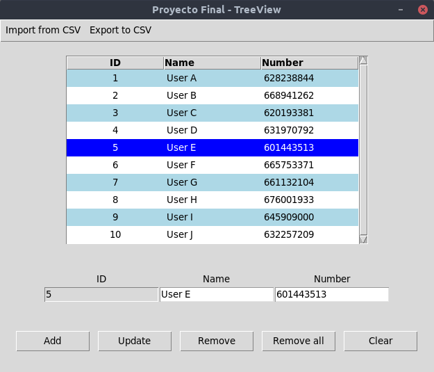

# Curso Avanzado de Python
Proyecto final del curso avanzado de Python impartido por EventEX.

## Requisitos mínimos
Un programa que abra un archivo CSV que contenga nombres y teléfonos (se asume que la 
primera fila son los nombres de los campos, que serán "NOMBRE" y "TELEFONO") y los 
almacene en una base de datos.

- Debe tener un interfaz de usuario de entre cualquiera de los que hemos visto que permita 
elegir el fichero CSV y muestre el resultado de la operación.
- Debe tener control de errores, para casos como si no se encuentra el fichero o no se 
puede leer etc.
- Debe estar documentado, preferentemente con docstrings.
- Debe funcionar correctamente y sin errores con un CSV aleatorio que crearé para probarlo.

Todos los archivos del proyecto deben entregarse en un archivo comprimido.
Si cumple estos puntos, será suficiente para aprobar.

## Para nota

Para conseguir más nota, se podrán añadir funcionalidades o aspectos.

Algunos ejemplos de añadidos:

- Un interfaz para consultar teléfonos en la base de datos. Para añadir nuevos. para actualizarlos.
- Usar de formas interesantes las estructuras del lenguaje que hemos visto a lo largo del curso.

## Previsualización

